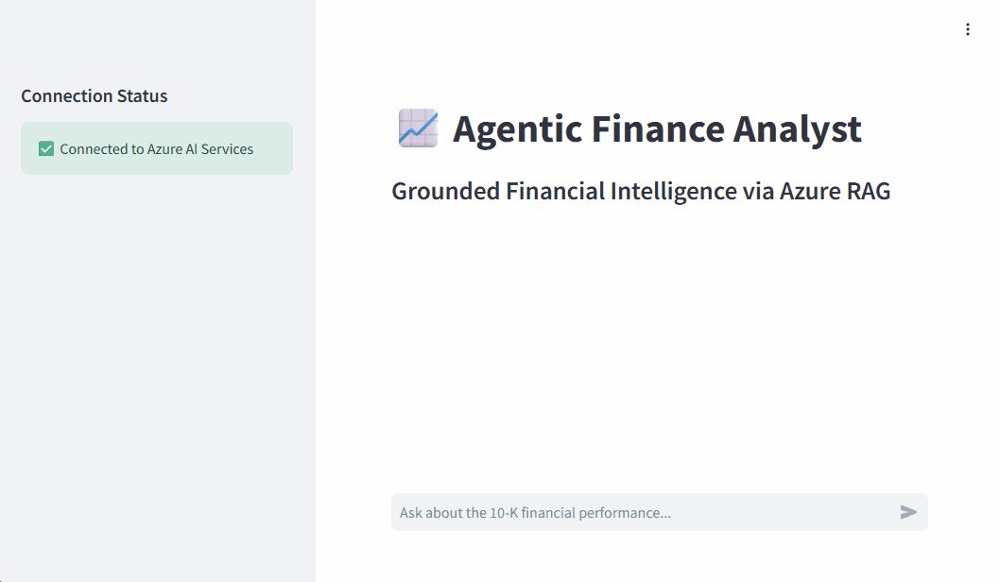

# 📈 Agentic Finance Analyst (RAG with Azure AI)



A production-ready AI finance assistant built on **Databricks Apps**. This system utilizes **Retrieval-Augmented Generation (RAG)** to provide high-precision answers grounded in complex financial documents (e.g., 10-K reports).

---

## 🚀 Features

- **Hybrid Search:** Combines vector and keyword search using Azure AI Search for high-accuracy retrieval of financial tables and text.
- **Agentic Logic:** Uses a self-correcting RAG chain to verify context before answering.
- **Source Citations:** Every answer includes clickable citations of the original document source and page number.
- **Enterprise Observability:** Integrated with **LangSmith** for real-time trace monitoring, latency tracking, and cost analysis.
- **Cloud-Native:** Deployed as a serverless application on Databricks.

---

## 🏗️ Architecture & Data Flow


1. **Ingestion:** Financial PDFs are chunked and embedded via `text-embedding-3-small`.
2. **Retrieval:** Azure AI Search identifies relevant context using semantic ranking.
3. **Generation:** GPT-4o-mini synthesizes a cited answer based *only* on the provided context.
4. **Monitoring:** Every interaction is logged to LangSmith for performance auditing.

---

## 🧪 Tech Stack

- **Framework:** Python, LangChain (Classic & Core)
- **Frontend:** Streamlit
- **AI/LLM:** Azure OpenAI (GPT-4o-mini)
- **Vector Database:** Azure AI Search
- **Platform:** Databricks Apps
- **Observability:** LangSmith

---

## 🛠️ Observability & Monitoring

This project uses **LangSmith** to solve the "black box" problem of LLMs. 
- **Traces:** View the exact prompts and retrieved documents for every user query.
- **Feedback Loops:** Ability to annotate "Thumbs up/down" responses to build a gold-standard evaluation dataset.

---

## 📦 Installation & Setup

### 1. Clone the repository
```bash
git clone [https://github.com/Mohamad-Farahani/Finance_AI_Agent.git](https://github.com/Mohamad-Farahani/Finance_AI_Agent.git)
cd Finance_AI_Agent

###2. Configure Environment Variables
Create a .env file in the root directory:
```bash
AZURE_OPENAI_API_KEY=your_key
AZURE_OPENAI_ENDPOINT=your_endpoint
AZURE_SEARCH_ENDPOINT=your_search_endpoint
AZURE_SEARCH_KEY=your_search_key
LANGCHAIN_API_KEY=your_langsmith_key
LANGCHAIN_TRACING_V2=true

###3. Install Dependencies
```bash
pip install -r requirements.txt


###4. Run Locally
```bash
streamlit run app.py
